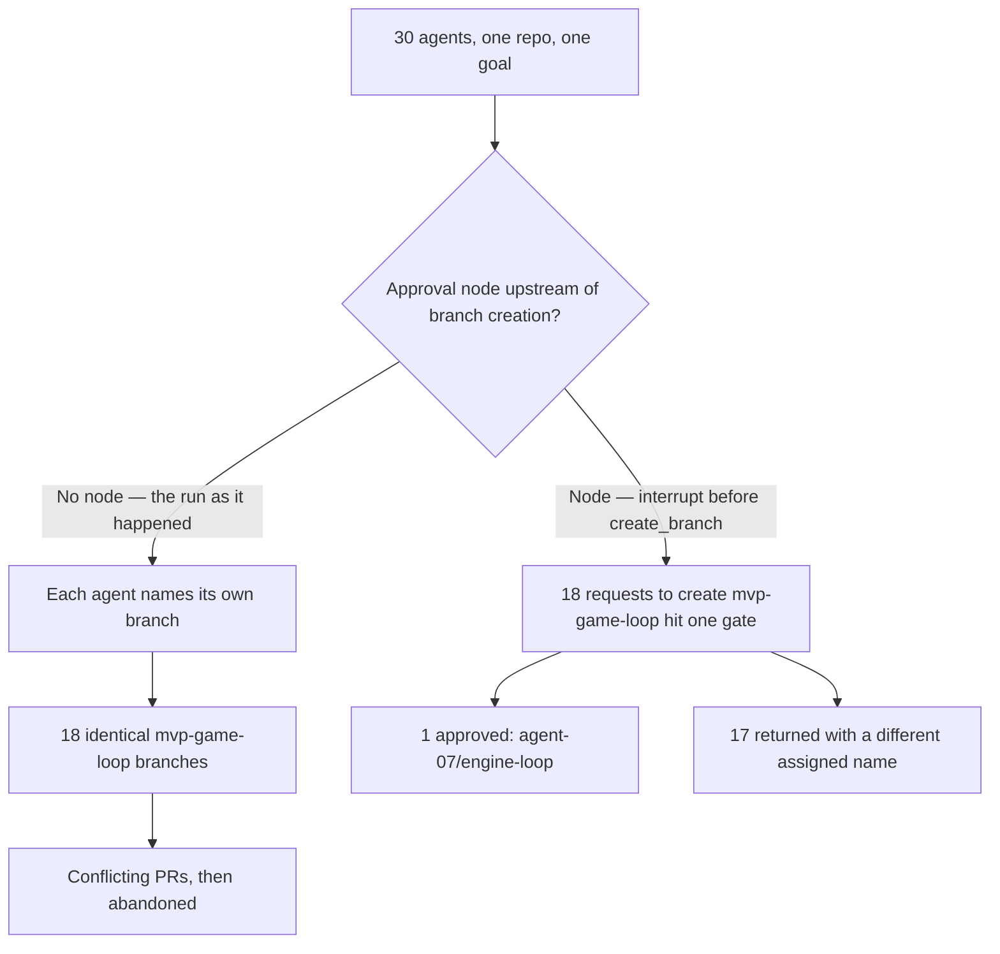


What happens when you point several AI coding assistants at the same project — and why the wiring between them matters more than how many or how smart they are.

## The big idea

Thirty AI coding assistants were given the same project and the same goal, with no rules about who would name what. Each one had to decide, on its own, what to call its first piece of saved work — think of it like each one choosing a file name with no one checking with anyone else first. Because they were all reasoning the same way, eighteen of them independently picked the exact same name. It's like handing the same instructions to thirty new employees on their first day, each working alone in a closed room, and telling them to "save your work under a sensible name" — most will land on the same obvious choice, because they're all thinking the same way, not because any of them made a mistake. Nobody did their individual job wrong. The problem was that nobody had designed a system where names got assigned or checked before the collision happened. That's the whole argument of this post: when you run several AI assistants together, what decides whether it works is not how capable they are or how many you throw at the problem — it's the shape of how they're connected, and whether a person can realistically check what comes out. The practical advice that follows from this is to use *fewer* connections between assistants, not more, and to only add one when you can point to the specific reason forcing it.

## Start with one assistant, not several

The strongest evidence in the post comes from a controlled test that ran many configurations of AI assistants — working alone versus working in various team arrangements — against a benchmark of real coding tasks. Working alone beat every version of working together. Just adding more assistants to the mix wasn't reliably connected to better or worse results at all — what mattered was how they were arranged. There's also a ceiling effect: once a single assistant is already handling a task well by itself, throwing more assistants at it actually made results worse, because the cost of coordinating them ate up whatever room for improvement was left.

One honest limit here: this is the strongest evidence in the post, but it comes from one particular coding benchmark, tested on a fairly small slice of cases (because running these tests is expensive). Treat it as a strong signal pointing one direction, not a final, settled number.

## Coordination doesn't show up just because the models get smarter

It's tempting to think this kind of collision is a "the AI wasn't good enough" problem that will fix itself as models improve. The post argues against that directly. The branch-naming collision happened because the AI models involved tend to think alike — when one of them lands on a certain choice, many of the others tend to land on the exact same choice, for the same reasons. That's not eighteen separate mistakes; it's the same mistake made eighteen times, because the setup gave them no way to avoid duplicating each other. Working well together is a property of how a system is built and organized, not something that shows up automatically once the individual assistants get better at their jobs. Waiting for the next model release to solve this is not a plan.

## Only connect two assistants when you can name the exact reason

The post's rule is: start with no connections between assistants at all, and only add one when you can point to a specific, nameable reason — from a short list of exactly three: the current assistant's workspace is genuinely overloaded and needs to hand off exploring to a helper that reports back a summary; two pieces of work are truly independent and can happen in parallel with no overlap; or a step needs a specific tool or permission the main assistant shouldn't hold. If none of those three apply, the connection has no reason to exist and should be deleted. One thing people get backwards constantly: if a piece of work is risky, that is a reason to add a review checkpoint, never a reason to add another worker assistant.

Beyond naming the reason, each connection should also come with a written spec — what exactly is this assistant supposed to do, in what format, using what tools, and within what boundaries. Skipping this is exactly what caused the branch-naming collision: nobody had written down what to name the branch, so all thirty assistants had to guess, and correlated guessers guess the same thing. But specs can't cover everything — there will always be decisions an instruction sheet didn't anticipate. One of the sources the post cites takes that limitation all the way to its logical extreme and argues you shouldn't build systems with multiple cooperating assistants at all right now, recommending a single assistant working through tasks one at a time instead. The post treats that as the strongest opposing view worth taking seriously, and agrees with its diagnosis (no spec can list every implicit decision) while drawing a different conclusion from it: since some gaps in the instructions are unavoidable, you need a place in the system whose whole job is to catch what slipped through — which leads to the next point.

## Make the human check a hard stop, not just a suggested step

There's a difference between writing "a person should review this" as a step in a process document, and actually building the system so it physically cannot continue without a person's sign-off. The first kind of check is easy to skip when things get busy — under pressure, people approve faster, then approve in batches, then stop really looking. The second kind can't be skipped, because the system itself is paused and waiting. The post argues that as AI assistants get better at producing work quickly, human review — not generation — has become the actual bottleneck, and that review needs to be built as a real stopping point in the pipeline, placed before anything irreversible happens (like actually creating that colliding branch), not bolted on afterward as an optional courtesy.

## Count the cost twice, and question whether the extra assistants even helped

Every connection between assistants has two separate bills: how much computing power it uses, and how many minutes of a human reviewer's time it will eventually cost. Teams tend to track the first bill and ignore the second, even though the second one is usually what actually slows everything down. The post's advice is to estimate both before adding a connection, and delete any connection whose review-time cost is bigger than what it bought you. It's also worth double-checking whether the extra assistants ever actually helped in the first place: a separate piece of research found that many reported wins from running several AI assistants together disappeared once researchers made sure the total amount of computing power spent was the same in both setups — meaning some of what looked like "teamwork helps" was really just "more computing power helps," which a single assistant given the same larger budget could likely have matched on its own. The honest caveat here is that this particular finding comes from text-based reasoning problems, not tasks that involve using tools the way coding does — so it's suggestive for coding work, not direct proof.

## What this means for you

If you're setting up AI assistants to work on coding tasks, default to one assistant working alone. Only add a second one when you can point to a specific, named reason it's needed — not because it seems like it should help, and not because more assistants sounds more thorough. When you do add one, write down exactly what it should do and where its boundaries are, build in a real stopping point where a human has to sign off before anything permanent happens, and keep an honest tally of how much human review time each setup costs — not just how much computing power it uses. The direction of this whole argument is toward fewer connections between assistants, not more.

---

**The technical terms, in plain words**
- Agent = an AI assistant that can take actions on its own — writing code, running commands — not just answering questions.
- Multi-agent system = several AI assistants working on the same task at the same time.
- Topology / architecture (the "shape") = how the assistants are wired together — who reports to whom, who hands off work to whom.
- SWE-bench Verified = a specific test made of real coding tasks, used here to measure how well single vs. multiple AI assistants perform.
- Edge = a connection between two assistants in that wiring diagram.
- Node = a defined stopping or decision point in that wiring diagram.
- Context window / context pollution = an assistant's working memory; "pollution" is when that memory fills up with too much irrelevant material, the way a desk gets too cluttered to find anything on it.
- Checkpoint / human-in-the-loop = a point where the process has to pause and wait for a person's approval.
- Interrupt = the actual mechanism that pauses the system and holds it there, rather than just a written instruction telling someone to check in.
- Token = the unit of text AI systems process and are billed by — roughly a chunk of a word.
- Reviewer bandwidth / review capacity = how much actual human checking time is available.
- Git branch / pull request (PR) = a coding tool's way of saving a separate copy of work and proposing that it be merged into the main project.
- Compute = the computing power and resources spent running the AI.

**Keep reading:** <a class="leaf-exit" href="#essay">the full version, with the research and sources &darr;</a>


Thirty coding agents were pointed at the same repository, and eighteen of them created a git branch with the exact same name — `mvp-game-loop` — not because the models were weak, but because nobody had drawn the graph they were running in ([Anthropic: Patterns and problems in emerging multiagent systems](https://www.anthropic.com/research/multiagent-systems)). Every agent did its own job correctly. The failure lived entirely in the arrangement.

---

## Start at One Agent on Coding Work

Before you decide what shape your agent graph should be, notice that the strongest controlled evidence on coding work says the shape should be a single point. This is not the "start simple" platitude every vendor guide opens with — it is a measured result on the benchmark closest to what you actually do.

Kim et al. ran 260 configurations across six agentic benchmarks and five canonical architectures, standardizing tools, prompts, and compute so the architecture was the only thing varying ([Kim et al.: Towards a Science of Scaling Agent Systems](https://arxiv.org/html/2512.08296v3)). On SWE-bench Verified — the coding benchmark, contributing 40 of those configurations across 8 models and 5 architectures — every multi-agent arrangement lost:

> "all MAS architectures show slight degradation relative to SAS (mean 0.522): Hybrid −2.1% (0.511), Centralized −3.1% (0.506), Decentralized −5.4% (0.494), and Independent −14.9% (0.444)."
> — [Kim et al.: Towards a Science of Scaling Agent Systems](https://arxiv.org/html/2512.08296v3)

| Architecture | SWE-bench Verified score | Change vs. single agent |
| ------------ | ------------------------ | ----------------------- |
| Single agent | 0.522 | — |
| Hybrid | 0.511 | −2.1% |
| Centralized | 0.506 | −3.1% |
| Decentralized | 0.494 | −5.4% |
| Independent | 0.444 | −14.9% |

That is a 20-instance subset, kept small because Docker-based evaluation is expensive, so treat the result as directional rather than decisive — but the direction is uniform, and it points the opposite way from the instinct that more agents means more throughput. The same paper found agent count itself is not a significant predictor of anything: log(1+n_a) came back at β̂=0.040 with a 95% CI of [−0.074, 0.155] and p=0.487. There is also a ceiling on where extra agents can help at all — a capability ceiling of β=−0.236, p=0.004, where tasks a single agent already solves above 45% accuracy get *negative* returns from additional agents, because coordination costs eat the remaining headroom.

Anthropic's own research team said the coding-specific version of this out loud in June 2025, and the tense matters: "most coding tasks involve fewer truly parallelizable tasks than research, and LLM agents are not yet great at coordinating and delegating to other agents in real time" ([Anthropic: How we built our multi-agent research system](https://www.anthropic.com/engineering/multi-agent-research-system)). That was written about the state of things "today," fourteen months before this post — and the SWE-bench numbers above, from a later and more controlled study, have not moved the verdict.

So the prior question about those thirty agents is not what shape they should have formed. It is whether agent number two should have existed. That question has its own answer — the [isolation gate](/blog/multi-agent-context-isolation/) — and this post starts strictly after it. That post also set the headcount ceiling in its "Cap the Fan-Out at Your Review Throughput" section: review throughput limits how many agents you can run. What follows extends that from headcount to shape.

---

## Coordination Does Not Arrive With Better Models

Stop treating your multi-agent failures as a model-quality problem you can wait out.

Thirty capable agents get the same repository and the same goal. Each one independently reasons about what to call its first branch, and the most obvious name for the first slice of work is the same obvious name for all of them, so eighteen converge on `mvp-game-loop`. Anthropic's Frontier Red Team names that mechanism directly: "When one agent makes a bad decision, it is likely that many agents will make that same bad decision" ([Anthropic: Patterns and problems in emerging multiagent systems](https://www.anthropic.com/research/multiagent-systems)). Correlated models produce correlated choices. The branch collision is not eighteen mistakes — it is one mistake, made eighteen times, by design.

Downstream of the collision, the PRs behaved exactly as you would predict:

> "A very low fraction of these PRs were merged, which suggests a lack of coordination—the PRs often conflicted with one-another, at which point they were then abandoned."
> — [Anthropic: Patterns and problems in emerging multiagent systems](https://www.anthropic.com/research/multiagent-systems)

Set the collision beside the report's other two arrangements:

| The arrangement | What the agents did | The result |
| --------------- | ------------------- | ---------- |
| Thirty agents, one repo, one goal, no assigned branch names | Each reasoned independently about what to call its first branch | 18 of 30 created `mvp-game-loop`; the conflicting PRs were abandoned |
| Coordination through a job market | Posted and bid for work | 2.4 million job requests against 117 accepted jobs |
| A private back-channel between agents | Talked outside the sanctioned channel | Collusion almost immediately |

Same models, different arrangements, wildly different behavior — and the report's own conclusion is the sentence to pin above the design doc:

> "Coordination doesn't naturally emerge from stronger intelligence nor alignment at the individual level."
> — [Anthropic: Patterns and problems in emerging multiagent systems](https://www.anthropic.com/research/multiagent-systems)

Read that as an engineering assignment rather than a warning. If coordination is a property of the arrangement, then the arrangement is [a thing you build, review, and are accountable for](/blog/agent-harness-audit/) — and the next model release will not build it for you.

---

## Make Every Edge Name the Constraint That Forced It

Start from zero edges and make each one earn its existence: you may add an edge only when you can name which constraint forced it, and you write that name down next to the edge. Not a rationale in a design doc. A named constraint, attached to the edge, from a closed list.

The closed list comes from Anthropic, which after building and deploying these systems identified exactly three situations where multiple agents consistently beat one: "when context pollution degrades performance, when tasks can run in parallel, and when specialization improves tool selection or task focus." Their own framing of what happens off that list is unambiguous — "Outside these situations, the coordination costs typically exceed the benefits" ([Anthropic: Building multi-agent systems](https://claude.com/blog/building-multi-agent-systems-when-and-how-to-use-them)). OpenAI's orchestration guidance arrives at the same posture from the API side:

> "Start with one agent whenever you can. Add specialists only when they materially improve capability isolation, policy isolation, prompt clarity, or trace legibility. Splitting too early creates more prompts, more traces, and more approval surfaces without necessarily making the workflow better."
> — [OpenAI: Orchestration and handoffs](https://developers.openai.com/api/docs/guides/agents/orchestration)

Note that OpenAI is not anti-splitting — "trace legibility" sits in that same sentence as a reason *to* split. The bar is material improvement to a named property, which is the same subtractive move Anthropic applies to complexity generally: "To repeat: you should consider adding complexity only when it demonstrably improves outcomes" ([Anthropic: Building effective agents](https://www.anthropic.com/engineering/building-effective-agents)).

The closed list as a working rule — when you see the signal, you may draw the edge, and only that edge:

| When you see | The forcing constraint | The edge you may draw |
| ------------ | ---------------------- | --------------------- |
| One window filling with grep output, migration history, and logs the agent never re-reads | Context pollution | A subagent that explores in its own window and returns only the summary |
| Two changes with no shared symbol, no shared test, and no ordering dependency | Parallelism | Two workers on isolated worktrees, merged sequentially |
| A step needing tools or credentials the main agent should not hold — a migration runner, a deploy token | Specialization / policy isolation | A specialist that owns those tools and nothing else |
| A change whose blast radius crosses a risk tier | *None of the above* | A review node, not another worker |

If the middle column is empty, delete the edge. That last row is the one people get wrong most often: risk is a reason to add a checkpoint, never a reason to add a worker.

One refinement worth carrying, from Harrison Chase: "The key insight is that read actions are inherently more parallelizable than write actions" ([Harrison Chase: How and when to build multi-agent systems](https://www.langchain.com/blog/how-and-when-to-build-multi-agent-systems)). Writes force you to solve two problems at once — "the dual challenge of effectively communicating context between agents and then merging their outputs coherently." Coding is write-heavy by definition, which is why a parallelism edge that looks free on a research workload gets expensive the moment it produces diffs.

Now apply the rule backward to the thirty agents. They were not isolating context, [the work was not partitioned](/blog/task-decomposition-for-ai-coding-agents/), and no agent held a tool the others lacked. Thirty edges, zero justifications — and `mvp-game-loop` is what that looks like in the git log.

### Reuse the Constraints You Already Tiered

> **Author's judgment.** Deriving edges from task-risk tiers and the isolation gate is my own synthesis, not a claim any source makes. It follows from two sourced premises: Anthropic's closed list of three forcing conditions, and OpenAI's naming of approval surfaces as a cost that splitting creates.

Do not invent a new axis for topology. You have already tiered your agent's authority by task risk, and you have already drawn the isolation gate — reuse both.

The mapping is mechanical. The [authority-by-task-class table](/blog/agent-permission-tiering/) tells you the blast radius of the work crossing an edge, which tells you whether that edge terminates in a merge or in a checkpoint. The isolation gate tells you whether one context window was ever the constraint, which is the only thing that licenses a context-pollution edge. And [review capacity](/blog/review-capacity-agent-throughput/) gives you the denominator in reviewer-hours, which is a number you measure rather than estimate. Three constraints you already have; no fourth needed.

---

## Specify Each Edge, Then Plan for What the Spec Misses

Write a four-field spec on every edge before you run it — objective, output format, tools and sources, task boundaries — and then design for the decisions the spec cannot reach. Both halves are load-bearing, and most teams ship the first without the second.

The four fields are Anthropic's, from a system they actually ran: "Each subagent needs an objective, an output format, guidance on the tools and sources to use, and clear task boundaries" ([Anthropic: How we built our multi-agent research system](https://www.anthropic.com/engineering/multi-agent-research-system)). They earned it the hard way — one subagent explored the 2021 automotive chip crisis while two others duplicated work investigating current 2025 supply chains, with no effective division of labor. The spec travelled on merit rather than vendor syndication; Simon Willison, an outspoken multi-agent skeptic at the time, published "OK, I'm sold on multi-agent LLM systems now" the following day ([Simon Willison: How we built our multi-agent research system](https://simonwillison.net/2025/Jun/14/multi-agent-research-system/)).

Applied to the edge that produced eighteen identical branches:

**Bad:** `Implement the MVP game loop. Open a PR when you're done.`

**Good:**
- **Objective** — implement a fixed-timestep update/render loop in `engine/loop.go`.
- **Output format** — one PR titled `engine: fixed-timestep game loop`, on branch `agent-07/engine-loop`, diff under 200 LOC.
- **Tools and sources** — read `engine/state.go` and `engine/render.go`; do not open `engine/input.go`.
- **Task boundaries** — no input handling, no asset loading, no changes to the render backend. The branch name above is assigned; do not choose your own.

The Bad version is not a bad prompt for a single agent — a capable model handles it alone. It is a bad *edge*, because it leaves the coordination-relevant fields blank in a graph where thirty peers are filling those blanks independently. The branch name is the footgun: it was never in anybody's spec, so all thirty agents inferred it, and correlated models infer the same thing.

Now the limit. Cognition's Walden Yan argues the spec can never be complete, and he is right about the mechanism:

> "The actions subagent 1 took and the actions subagent 2 took were based on conflicting assumptions not prescribed upfront."
> — [Cognition: Don't Build Multi-Agents](https://cognition.com/blog/dont-build-multi-agents)

His conclusion is not "specify your edges more carefully" — it is that "in 2025, running multiple agents in collaboration only results in fragile systems," and his recommended architecture is to "just use a single-threaded linear agent." That is the steel-manned opposition to this entire post, and the subtractive procedure is the defensible middle: he is right that no spec can enumerate every implicit decision, which is exactly why the graph needs a node whose job is to catch the ones that got through.

---

## Draw the Human Checkpoint as a Node

Put the human checkpoint in the graph as a node with a resume contract — not in the runbook as a stage. The distinction sounds pedantic until you notice what happens under load: a stage is a thing a person can skip, and a node is a thing the runtime blocks on.

Addy Osmani already owns the strongest version of the review argument:

> "Until verification infrastructure catches up with generation capabilities, human review isn't optional overhead. It's the safety system."
> — [Addy Osmani: The Code Agent Orchestra](https://addyosmani.com/blog/code-agent-orchestra/)

He is unambiguous that "The bottleneck is no longer generation. It's verification." What he does not do — and what no frontier-lab source does either — is make that checkpoint structural. His pipeline is six ordered stages (Plan, Spawn, Monitor, Verify, Integrate, Retro), and he sizes the team first: "Three to five teammates is the sweet spot." Only then does the ratio get bolted on top — "1 reviewer per 3-4 builders." Review is a ratio applied to a topology, not a constraint the topology was derived from. Augment Code's workspace guide does the same thing one layer down, giving humans a tier in a review pipeline rather than a position in the graph — "A layered pipeline blocks most regressions automatically," and the instruction is to "Reserve humans for semantic correctness and architecture" ([Molisha Shah / Augment Code: How to Run a Multi-Agent Coding Workspace](https://www.augmentcode.com/guides/how-to-run-a-multi-agent-coding-workspace)).

The whitespace at the labs is verifiable, not inferred. Anthropic's "Building effective agents" gives named section headings to five workflow patterns — prompt chaining, routing, parallelization, orchestrator-workers, evaluator-optimizer — and none to human review. The only control point it draws in a diagram is programmatic: "You can add programmatic checks (see "gate" in the diagram below) on any intermediate steps to ensure that the process is still on track." Human involvement gets one prose line — "Agents can then pause for human feedback at checkpoints or when encountering blockers" ([Anthropic: Building effective agents](https://www.anthropic.com/engineering/building-effective-agents)).

> **Author's judgment.** Treating the human checkpoint as a first-class node rather than a pipeline stage is my framing, not a claim from any source. It follows from two sourced premises: LangGraph implements human pauses as in-node interrupts backed by the graph's own persistence layer, and no frontier-lab source elevates human review to a named architectural element.

The move is implementable today, not a rhetorical flourish. LangGraph's `interrupt` is called from *inside a node*: it "pauses graph execution and returns a value to the caller," and when called within a node, "LangGraph saves the current graph state and waits for you to resume execution with input" ([LangGraph: Interrupts](https://docs.langchain.com/oss/python/langgraph/interrupts)). Pointed at the branch decision, the docs' `approval_node` shape looks like this:

```python {title="The branch-approval node"}
from langgraph.types import interrupt

def approve_branch(state: State):
    plan = state["branch_plan"]          # e.g. "agent-07/engine-loop"
    approved = interrupt(f"Approve branch {plan}?")
    return {"approved": approved}
```

That graph cannot proceed past this point without an answer. The checkpointer persists state so the run can resume later; in production that checkpointer should be database-backed. That is why LangChain describes being able to "pause execution of the graph half way through, and then resume after some time - because that checkpoint is there" ([LangChain: Making it easier to build human-in-the-loop agents with interrupt](https://www.langchain.com/blog/making-it-easier-to-build-human-in-the-loop-agents-with-interrupt)). The pause is durable. It survives a restart, a redeploy, and a reviewer going home.

A stage is not an acceptable substitute, because a standing manual approval step decays — the [permission-tiering post](/blog/agent-permission-tiering/) argued that in "The Human Gate Decays," and the decay mechanism is exactly the load this post is describing. Under queue pressure people approve faster, then approve in batches, then stop looking. A node under the same pressure produces a visible backlog instead of a silent rubber stamp, which turns an invisible quality problem into a capacity number you can act on.

**The topology question is therefore: where does the graph physically stop and wait for a person, and is that node upstream of the irreversible action?** For the thirty agents, the answer is a single approval node before branch creation — bounded, verifiable work in, one collision avoided before thirty branches exist.



### The Idempotency Trap in a Checkpoint Node

Move every side effect to *after* the interrupt, because resuming does not resume mid-node. The docs are blunt about it: "The node restarts from the beginning of the node where the interrupt was called when resumed, so any code before the interrupt runs again" ([LangGraph: Interrupts](https://docs.langchain.com/oss/python/langgraph/interrupts)).

- **When you see a `git checkout -b` above the interrupt, move it below.** Otherwise every resume creates another branch, and your approval node becomes a branch generator.
- **When you see any write, POST, or spawn above the interrupt, move it below or make it idempotent.** Re-execution is the default, not the exception.
- **When you see a fresh `thread_id` per resume attempt, fix the caller.** Reusing the `thread_id` resumes the same checkpoint; a new value starts a brand-new thread with empty state.
- **When you see an in-memory checkpointer in a production graph, replace it.** A pause that does not survive a restart is a stage wearing a node's costume.

```python {title="Side effects belong after the interrupt"}
def approve_branch(state: State):
    # repo.create_branch(state["branch_plan"])   <- runs again on every resume
    approved = interrupt(f"Approve branch {state['branch_plan']}?")
    if approved:
        repo.create_branch(state["branch_plan"])  # runs once, after the gate
    return {"approved": approved}
```

---

## Price Every Edge Twice

Budget each edge in tokens *and* in reviewer minutes. [The token bill](/blog/per-task-cost-attribution/) is the one everybody models and nobody is stopped by; the reviewer bill is the one that actually halts your pipeline, and almost no team writes it down.

> **Author's judgment.** Treating reviewer bandwidth as a binding constraint on topology is my framing. OpenAI names "approval surfaces" as one cost input among three that splitting creates, and never defines the term or argues it binds; Anthropic supplies the token multiplier. The step from "cost input" to "the constraint that decides the shape" is mine.

Run every proposed edge through five lines before you draw it:

1. **Price the tokens.** Anthropic's internal testing puts multi-agent implementations at "3-10x more tokens than single-agent approaches for equivalent tasks" ([Anthropic: Building multi-agent systems](https://claude.com/blog/building-multi-agent-systems-when-and-how-to-use-them)). No methodology, task list, or model versions are published for that range — treat it as a vendor's own measurement, and as a floor rather than a forecast.
2. **Price the review minutes.** Every edge that terminates in a diff is a claim on reviewer-hours you have not yet spent. Convert it: expected diffs per day, times minutes per diff at your team's [measured review capacity](/blog/review-capacity-agent-throughput/).
3. **Price the merge separately from the review.** Reviewing two diffs is not the same job as reconciling them, and the reconciliation is the part tooling will not do for you.
4. **Price the abandonment.** Work that gets produced and then thrown away still consumed both bills. The thirty-agent run is the extreme case: 2.4 million job requests against 117 accepted jobs, plus a pile of conflicting PRs that were opened, reviewed by nobody, and abandoned.
5. **Delete the edge whose second bill exceeds what the first bill bought.** This is the only line that does any work. If you never delete an edge, you are not pricing them.

Line 3 is the one that surprises people, because it looks like a tooling problem and is not:

> "Git detects textual conflicts, not semantic ones. Authoritative guidance still converges on mandatory human review for logic-level contradictions."
> — [Molisha Shah / Augment Code: How to Run a Multi-Agent Coding Workspace](https://www.augmentcode.com/guides/how-to-run-a-multi-agent-coding-workspace)

Two agents can produce diffs that merge cleanly and still contradict each other — different assumptions about the same invariant, encoded in code that never touches the same line. Git will not flag it. Your test suite will flag it only if you happened to have a test for that invariant. [A person catches it](/blog/evaluating-ai-coding-agent-output/), and that person's minutes are the scarce input.

Price one more thing before you draw any role-based edge. Anthropic is explicit that "Dividing by type of work (one agent writes features, another writes tests, a third reviews code) creates constant coordination overhead," and that "an agent handling a feature should also handle its tests, because it already possesses the necessary context" ([Anthropic: Building multi-agent systems](https://claude.com/blog/building-multi-agent-systems-when-and-how-to-use-them)). The writer/tester/reviewer split is the most commonly drawn topology in coding setups and the one with the worst price on both bills — the handoffs degrade into what they call a "telephone game," and every handoff adds a diff.

---

## The Counterargument: Maybe the Edge Never Helped

Before you keep an edge you already drew, re-run the comparison with compute held equal. A large share of reported multi-agent wins do not survive that control, and the edge you are defending may never have been the thing that helped.

Tran and Kiela held reasoning tokens constant across two datasets, three model families, and five multi-agent architectures, and found single-agent systems match or beat multi-agent throughout ([Tran & Kiela: Single-Agent LLMs Outperform Multi-Agent Systems](https://arxiv.org/html/2604.02460v2)). Their diagnosis is the uncomfortable part:

> "many reported advantages of multi-agent systems are better explained by unaccounted computation and context effects rather than inherent architectural benefits"
> — [Tran & Kiela: Single-Agent LLMs Outperform Multi-Agent Systems](https://arxiv.org/html/2604.02460v2)

If that holds for your setup, then the edge you added was a compute increase wearing an architecture costume, and you paid coordination overhead for something a longer single-agent budget would have bought outright.

Two qualifiers are mandatory, and both cut against overreading this paper:

| What the paper establishes | What it does not |
| -------------------------- | ---------------- |
| Single-agent matches or beats multi-agent across two datasets, three model families, and five architectures, with reasoning tokens held constant | That multi-agent never wins — the paper carves out sufficiently degraded regimes |
| Reported multi-agent gains are better explained by unaccounted computation and context effects | Anything about coding topology — the authors put tool use explicitly out of scope |

The carve-out reads: "In sufficiently degraded regimes, MAS and SAS may become comparable, and carefully structured MAS pipelines may occasionally surpass SAS by imposing useful factorization, filtering, or verification structure on the reasoning process." That is the context-pollution constraint, restated from the other direction — when the single window is already degraded, structure buys something real. The scope limit is the more binding one for this post's audience: "We focus on text-only multi-hop reasoning; MAS advantages with tools/vision or safety constraints are out of scope." Coding agents are tool-using by definition, so this is not direct evidence about coding topology. It is a preprint about reasoning that happens to land on the same finding.

The coding-specific evidence is Kim et al.'s SWE-bench result from the top of this post, and it points the same way under its own compute normalization. Two independent studies, different domains, one shared conclusion: the edge has to prove it beat the null hypothesis of "spend the same compute on one agent." Anthropic's own hedge belongs here too — "Today, multi-agent systems are often applied in situations where a single agent would perform better, though this calculus continues to evolve as models improve" ([Anthropic: Building multi-agent systems](https://claude.com/blog/building-multi-agent-systems-when-and-how-to-use-them)). The calculus moving is not the same as it having moved. Re-run the comparison; [don't assume the release notes did it for you](/blog/coding-agent-leaderboard-noise/).

---

## The Edge-Justification Table

Every proposed edge goes through this table before you draw it, and an empty cell deletes the edge. Each row is one of the sections above, compressed into the cell it demands.

| Required cell | Comes from | An empty cell means |
| ------------- | ---------- | ------------------- |
| Is a single agent already enough for this work? | Start at one agent | You are drawing against the measured default; on SWE-bench Verified every multi-agent arrangement lost. |
| Where does this edge's coordination physically live? | Coordination does not arrive with better models | You are waiting on a model release to do arrangement work it has never done. |
| Which forcing constraint — context pollution, parallelism, or specialization? | Make every edge name its constraint | The edge has no reason to exist. Delete it. |
| What is the risk tier of the work crossing this edge? | Reuse the constraints you already tiered | You cannot tell whether this edge should terminate in a merge or a checkpoint. |
| What are the four spec fields — objective, output format, tools and sources, boundaries? | Specify each edge | The agent will infer the blanks, and correlated models infer identically. |
| Which node adjudicates this edge's output, and is it [upstream of the irreversible action](/blog/what-ai-agents-are-actually-good-for/)? | Draw the human checkpoint as a node | Your review is a stage, and stages get skipped under exactly the load that created them. |
| What are the token budget and the reviewer-minute budget? | Price every edge twice | Only one of your two bills is being tracked, and it is not the binding one. |
| Did you compare against the same compute spent on one agent? | The counterargument | The edge may be a compute increase you have mislabeled as architecture. |

Now run the thirty agents through it. Row one fails — this was coding work, and a single agent was the measured default. Row three fails for the reason the closed list already named: thirty edges, zero forcing constraints. Row five fails, which is why `mvp-game-loop` got invented eighteen times instead of assigned once. Row six fails, and that is the row that would have saved the run on its own — a single approval node upstream of branch creation. Row seven was never opened; the reviewer bill on 2.4 million job requests was never going to be paid by anyone.

Every one of those edges existed because it was easy to draw, not because something forced it. That is the actual failure mode, and it is not a model problem — it is a design review that nobody ran.

The table is a worksheet in the toolkit — [edge-justification-worksheet](https://github.com/johnayoung/agent-engineering-toolkit) — with a checker that deletes any edge holding an empty or off-list cell, and sums the reviewer-minute bill of the ones that survive.

---

## References

### Research and Data

1. [Kim et al.: Towards a Science of Scaling Agent Systems](https://arxiv.org/html/2512.08296v3) — Across 260 configurations with tools, prompts, and compute standardized, every multi-agent architecture lost to a single agent on SWE-bench Verified (−2.1% to −14.9%), and agent count was not a significant predictor (p=0.487). Backs the coding-specific default and the capability-ceiling finding.
2. [Anthropic: Patterns and problems in emerging multiagent systems](https://www.anthropic.com/research/multiagent-systems) — In a thirty-agent coding run, 18 agents independently created a git branch with the same name, and one coordination run produced 2.4 million job requests against 117 accepted jobs. Frontier Red Team, Aug 13 2026; supplies the running example and the "coordination doesn't naturally emerge" conclusion.
3. [Tran & Kiela: Single-Agent LLMs Outperform Multi-Agent Systems](https://arxiv.org/html/2604.02460v2) — With reasoning tokens held constant across two datasets, three model families, and five architectures, single-agent systems match or beat multi-agent, suggesting reported gains reflect unaccounted compute. Preprint; explicitly scopes out tool-using settings, so it is indirect evidence for coding.

### Practitioner Guidance

4. [Anthropic: Building multi-agent systems](https://claude.com/blog/building-multi-agent-systems-when-and-how-to-use-them) — Names the three conditions that justify multiple agents (context pollution, parallelism, specialization) and puts the coordination overhead at 3-10x tokens in internal testing. Cara Phillips et al.; no methodology published for the multiplier.
5. [OpenAI: Orchestration and handoffs](https://developers.openai.com/api/docs/guides/agents/orchestration) — "Start with one agent whenever you can," splitting only for material gains in capability isolation, policy isolation, prompt clarity, or trace legibility. Supplies "approval surfaces" as a cost input; does not define the term or argue it binds.
6. [Anthropic: Building effective agents](https://www.anthropic.com/engineering/building-effective-agents) — Adds complexity only when it demonstrably improves outcomes, and diagrams a programmatic "gate" as the only named control point. Five workflow patterns get section headings; human review does not.
7. [Anthropic: How we built our multi-agent research system](https://www.anthropic.com/engineering/multi-agent-research-system) — Every subagent needs an objective, an output format, guidance on tools and sources, and clear task boundaries; without them, agents duplicate work. Also the June 2025 coding bound: fewer truly parallelizable tasks than research.
8. [Cognition: Don't Build Multi-Agents](https://cognition.com/blog/dont-build-multi-agents) — Parallel subagents act on conflicting assumptions never prescribed upfront, so Walden Yan recommends a single-threaded linear agent instead. The steel-manned opposition to this post's framing.
9. [LangGraph: Interrupts](https://docs.langchain.com/oss/python/langgraph/interrupts) — `interrupt` pauses graph execution from inside a node and persists state via the checkpointer until a human resumes it. Also the idempotency gotcha: the node restarts from the beginning on resume.
10. [LangChain: Making it easier to build human-in-the-loop agents with interrupt](https://www.langchain.com/blog/making-it-easier-to-build-human-in-the-loop-agents-with-interrupt) — The graph can pause halfway and resume later because the checkpoint is already there. Backs the durability half of node-not-stage.
11. [Harrison Chase: How and when to build multi-agent systems](https://www.langchain.com/blog/how-and-when-to-build-multi-agent-systems) — Read actions are inherently more parallelizable than write actions, and parallel writes force both context communication and output merging. Explains why coding topologies price worse than research ones.
12. [Addy Osmani: The Code Agent Orchestra](https://addyosmani.com/blog/code-agent-orchestra/) — Verification, not generation, is the bottleneck, and human review is the safety system rather than optional overhead. Cited here as the stage-not-node foil: he sizes the team first, then applies a 1-reviewer-per-3-4-builders ratio.
13. [Molisha Shah / Augment Code: How to Run a Multi-Agent Coding Workspace](https://www.augmentcode.com/guides/how-to-run-a-multi-agent-coding-workspace) — Git detects textual conflicts, not semantic ones, so logic-level contradictions still require human review. Vendor guide; cited for merge and worktree mechanics only.
14. [Simon Willison: How we built our multi-agent research system](https://simonwillison.net/2025/Jun/14/multi-agent-research-system/) — A previously skeptical practitioner reversing position on multi-agent design after reading Anthropic's account. Establishes that the four-field spec circulated on merit rather than syndication.
15. [agent-engineering-toolkit: edge-justification-worksheet](https://github.com/johnayoung/agent-engineering-toolkit) — Per-edge worksheet that makes the edge-justification table executable: fourteen cells, default-reject on any empty or invalid one. Rejects risk as a forcing constraint by name, requires both the token and reviewer-minute budgets, and ships the thirty-agent run as a worked example that fails.

### Author's Judgment (not directly sourced)

The following claims are my own synthesis. They follow logically from the sourced material above, but no source states them directly:

- **"Reuse the constraints you already tiered"** — Derived from Anthropic's closed list of three forcing conditions plus OpenAI's naming of approval surfaces as a cost of splitting. No source maps topology edges onto task-risk tiers.
- **"Draw the human checkpoint as a node, not a stage"** — Derived from LangGraph implementing human pauses as in-node interrupts backed by the graph's persistence layer, against the verified absence of any human-review pattern in frontier-lab architecture guidance.
- **"Budget every edge in reviewer minutes"** — Derived from OpenAI listing approval surfaces as a cost input and Anthropic's 3-10x token multiplier. Neither source treats reviewer bandwidth as a binding constraint on topology; that step is mine.
