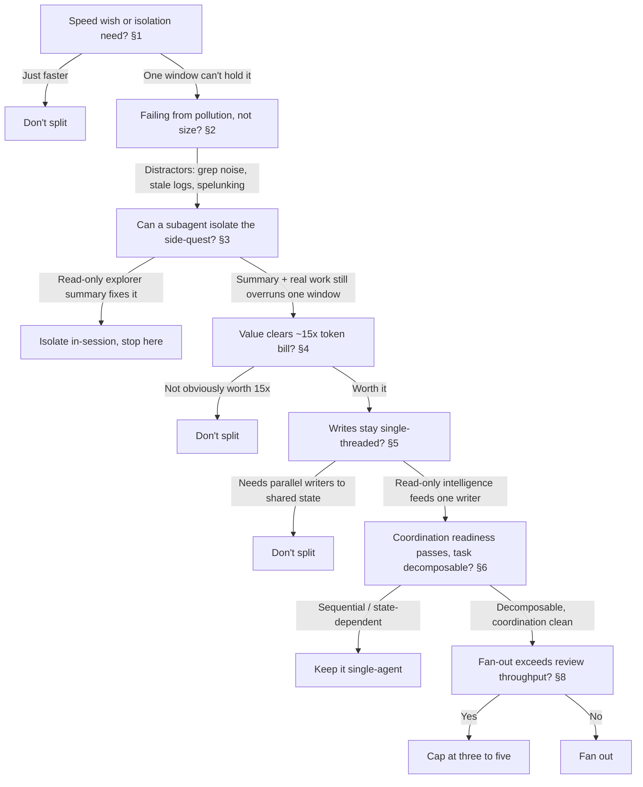

The default advice — "go multi-agent when your work is parallelizable" — answers the wrong question. Parallelism is the payoff you hope for, but context isolation is the reason you actually split, and Anthropic's own numbers put the price at about 15x the tokens of a single chat ([Anthropic: How we built our multi-agent research system](https://www.anthropic.com/engineering/multi-agent-research-system)). So the decision isn't "can this run in parallel?" It's "has one context window stopped being enough to hold this job — and is fixing that worth the bill?"

Take one concrete scenario and hold it through the whole post: you are adding a non-trivial feature to a large codebase, and a single agent's window is filling with codebase exploration, migration spelunking, and unrelated log output before it writes a line. Every gate below is applied to that same feature.

---

## Stop Asking "Is It Parallelizable" — Ask "Is One Window Still Enough"

People reach for a second agent because the work *looks* splittable. That instinct optimizes for speed, and speed is the wrong trigger. The real trigger is that one agent can only hold so much — large codebases overwhelm a single context window, and once that happens the split is about relieving the window, not racing a clock ([Addy Osmani: The Code Agent Orchestra](https://addyosmani.com/blog/code-agent-orchestra/)).

That reframe changes what a multi-agent system is *for*. In Anthropic's research setup, the benefit isn't that many agents run at once — it's that each one carries its own window and hands back a compressed result:

> "Subagents facilitate compression by operating in parallel with their own context windows, exploring different aspects of the question simultaneously before condensing the most important tokens for the lead research agent."
> — [Anthropic: How we built our multi-agent research system](https://www.anthropic.com/engineering/multi-agent-research-system)

Read that carefully: the parallelism is incidental, the *compression* is the point. The extra windows exist so the lead agent never has to hold the raw exploration — it gets the condensed version. That is context isolation doing the work.

Apply it to the feature. The single agent is drowning not because the feature is enormous but because everything it touches — the migration history, the log output, the files it grepped to orient itself — is piling into one window alongside the code it's supposed to write. This is the same problem sizing solves upstream: a [well-sized task](/blog/how-to-size-tasks-for-ai-coding-agents/) is one that stays inside a single window. This post is what to do when the feature is legitimately too big for that, and one window has stopped being enough.

**The multi-agent question is therefore: not "can I parallelize this?" but "is one window still enough to hold it cleanly?"**

---

## Split When Pollution — Not Size — Breaks the Window

When a single agent's output degrades, the reflex is to blame length — the context is "too full." That's usually the wrong diagnosis. Look for pollution before you look at the token count, because irrelevant content degrades output well before you approach any size limit.

When you see these in the agent's window, treat it as pollution, not size:

- **Search results it grepped once and never reads again** — orientation noise that stays resident in context.
- **Stale log output** pasted in to debug one thing, now sitting there for the rest of the session.
- **Dead-end files** the agent opened, ruled out, and left in the window.
- **Migration spelunking** — the history it walked to understand the schema, most of which is irrelevant to the change.

Each of these is a distractor, and distractors are measurably corrosive. Chroma's context-rot study, which tested 18 models, found the effect starts small and immediately:

> "Even a single distractor reduces performance relative to the baseline (needle only)."
> — [Chroma: Context Rot](https://www.trychroma.com/research/context-rot)

The reason this catches people off guard is that the standard benchmarks hide it. Models do well on simple needle-in-a-haystack retrieval, which produces a false sense that long context is handled — "which has led to the perception that long-context is largely solved" ([Chroma: Context Rot](https://www.trychroma.com/research/context-rot)). It isn't. The window fills with distractors and quality erodes, and no token counter warns you, because the count is still comfortably under the limit.

For the feature, this is the actual failure mode. The agent isn't failing because the change is "big" — it's failing because the migration spelunking and the log output polluted the window it needed for the code. That's the same context-rot slope that sizing works to avoid, and the fix is to get the distractors *out* of the window, not to buy a bigger one.

---

## Isolate the Side-Quest With a Subagent Before You Split the Whole Job

Full multi-agent is the expensive answer. Before you pay for it, run the cheap one: hand the polluting side-quest to a subagent so the main window stays clean. The Claude Code docs name the exact trigger:

> "Use one when a side task would flood your main conversation with search results, logs, or file contents you won't reference again: the subagent does that work in its own context and returns only the summary."
> — [Claude Code Docs: Create custom subagents](https://code.claude.com/docs/en/sub-agents)

That is context isolation without a full split. The mechanism is that "each subagent runs in its own context window with a custom system prompt, specific tool access, and independent permissions" ([Claude Code Docs: Create custom subagents](https://code.claude.com/docs/en/sub-agents)) — so the exploration happens somewhere else and only its conclusion comes back.

For the feature, the move is to spin the codebase exploration out:

```markdown
## Subagent: codebase-explorer

### Goal
Locate every call site of the current user-registration flow and the
existing migration pattern. Return a summary, not the raw files.

### Return only
- The 3–5 files the writer agent must edit, with one-line reasons.
- The migration format to mirror (file path + shape), not its full history.
- Any constraint the writer can't infer (naming conventions, ordering).

### Do not
- Paste full file contents or log output back into the main conversation.
- Make edits. This agent reads and reports; it does not write.
```

The main agent now gets the three-to-five-file answer instead of the grep transcript, the migration *shape* instead of the migration *spelunking*. Its window holds the code and the summary — nothing else. This is [just-in-time context](/blog/anatomy-of-a-perfect-ai-agent-task/) applied across a window boundary: pull the exploration in as a condensed pointer, not as raw pages.

Reach for a full split only after this stops being enough — when even the isolated summary plus the real work overruns one writer's window. Most of the time it won't, and you've avoided the 15x bill entirely.

---

## Make the Value Clear the 15x Token Bill Before You Split

If in-session isolation isn't enough and you're committing to separate agents, price it first. Multi-agent is not a free upgrade — it is a specific, measurable multiple on cost:

> "agents typically use about 4× more tokens than chat interactions, and multi-agent systems use about 15× more tokens than chats"
> — [Anthropic: How we built our multi-agent research system](https://www.anthropic.com/engineering/multi-agent-research-system)

Fifteen times is not a rounding error you can wave through on the assumption that faster is better. And cost isn't a side concern here — in Anthropic's own evaluation, "token usage by itself explains 80% of the variance" in performance ([Anthropic: How we built our multi-agent research system](https://www.anthropic.com/engineering/multi-agent-research-system)). You're paying 15x for the same lever that drives the results.

So the test is a value test, not a speed test. The isolation benefit — the clean windows, the compressed hand-back — has to be worth that bill on its own terms. "It would finish sooner" does not clear it; "one window genuinely cannot hold this and the isolation is what makes the output correct" might. If the value isn't obvious at 15x, that's your answer: don't split.

---

## Don't Split Until Writes Can Stay Single-Threaded

The first gate asks whether one window is enough. The second asks something independent: even if you *should* isolate context, can you do it safely? The answer turns on writes.

When you see these signals, keep one writer and make the extra agents read-only:

- **The task mutates shared state** — migrations, code edits, generated files. Parallel writers here corrupt each other.
- **Agents would need to hand off partial work** — each handoff is a place for their private decisions to conflict.
- **The value is in exploration, not action** — then the added agents should explore and report, and a single agent should write.

That last pattern is the one that actually works in practice. Cognition's read on the current state is blunt about which shape survives contact with reality:

> "multi-agent systems work best today when writes stay single-threaded and the additional agents contribute intelligence rather than actions"
> — [Cognition (Walden Yan): Multi-Agents: What's Actually Working](https://cognition.com/blog/multi-agents-working)

This is not a fringe constraint — it's the norm. As Cognition puts it, "most multi-agent setups in the world are limited to 'readonly' subagents" ([Cognition (Walden Yan): Multi-Agents: What's Actually Working](https://cognition.com/blog/multi-agents-working)). The working configuration is read-only intelligence feeding a single writer, not a swarm of parallel writers.

For the feature, that resolves the architecture. The migrations and the code edits are writes — so the safe split is read-only explorer subagents (the codebase-explorer from the last section is exactly this) feeding one agent that does all the writing. You get the context isolation without handing the shared state to a swarm. If you can't arrange the work that way — if the split genuinely requires two agents writing to the same tree — the second gate fails and you don't split.

---

## Treat Coordination Readiness as a Test, Not a Vibe

"Can writes stay single-threaded" is the principle; coordination readiness is where you check it against the concrete surface of the actual feature. Don't decide by optimism. Run the checklist:

1. **File ownership** — Does each agent own a disjoint set of files, or would two touch the same file? Overlap means a merge conflict you'll pay for later.
2. **Lock-file contention** — Would agents run git operations against the same working tree at the same time?
3. **Migration ordering** — Do the migrations have to apply in a fixed order? Ordered work is not parallel work.
4. **Dependency sequencing** — Does one piece consume another's output (the API before the client that calls it)?

Items 2 and 3 are not hypothetical. Concurrent git operations against one working directory fail hard:

> "Git uses file-based locking (.git/index.lock, .git/config.lock) to protect repository integrity. When two agents attempt concurrent git operations on the same working directory, the second agent receives a fatal error."
> — [Augment Code (Paula Hingel): Git Worktrees for Parallel AI Agent Execution](https://www.augmentcode.com/guides/git-worktrees-parallel-ai-agent-execution)

And ordered work resists parallelization by definition — when one task consumes another's output, "these tasks need to be sequenced, not parallelized" ([Augment Code (Paula Hingel): Git Worktrees for Parallel AI Agent Execution](https://www.augmentcode.com/guides/git-worktrees-parallel-ai-agent-execution)). For the feature, the migration must land before the code that reads the new column, and the lock file means two agents can't both commit against the working tree. That checklist, run against this specific feature, is what decides whether the split is safe — not a general sense that the work "seems parallel." A [tight spec](/blog/anatomy-of-a-perfect-ai-agent-task/) for each isolated task is what keeps ownership disjoint in the first place.

### When the Work Is State-Dependent, Keep It Single-Agent

The checklist has a hard case worth naming as its own rule: when each step mutates state the next step reads, don't parallelize it. This isn't a preference — it's the difference between a large gain and a large loss, measured across 260 controlled configurations:

> "Relative performance change compared to single-agent baseline ranges from +80.8% on decomposable financial reasoning to -70.0% on sequential planning, demonstrating that architecture-task alignment determines collaborative success."
> — [Kim et al. (arXiv): Towards a Science of Scaling Agent Systems](https://arxiv.org/abs/2512.08296)

Decomposable work swings up 80.8%; sequential, state-dependent work swings down 70.0%. Whether the split pays off is a property of the task's structure, not the enthusiasm behind it. Migration-then-code is sequential. Keep it on one writer.

---

## When the Split Backfires, It's Conflicting Decisions — Not a Weak Model

When a multi-agent run produces bad output, the instinct is to blame the model — "it wasn't smart enough." Look at the system design first, because that's where the failure almost always lives. The mechanism is that agents working in isolation each make small implicit choices, and those choices collide on recombination:

> "Actions carry implicit decisions, and conflicting decisions carry bad results."
> — [Cognition (Walden Yan): Don't Build Multi-Agents](https://cognition.com/blog/dont-build-multi-agents)

One agent names the field `phone`, another expects `phone_number`; one assumes the migration ran, another writes as if it hasn't. Neither is a capability gap — both are coordination failures. The empirical breakdown backs this: a study of multi-agent failures identifies "14 unique modes, clustered into 3 categories: (i) system design issues, (ii) inter-agent misalignment, and (iii) task verification" ([Cemri et al. (arXiv): Why Do Multi-Agent LLM Systems Fail?](https://arxiv.org/abs/2503.13657)).

Two of those three categories are coordination, and the third is verification — none is "the model is too weak." That's why single-threaded writes and the readiness checklist matter more than picking a stronger model: they remove the conflicting-decision surface instead of hoping capability papers over it. When your split backfires, debug the coordination design before you reach for a bigger model.

---

## Cap the Fan-Out at Your Review Throughput

There's a ceiling on fan-out, and it isn't set by the model — it's set by you. More agents generate more output, but generation is no longer the constraint:

> "The bottleneck is no longer generation. It's verification."
> — [Addy Osmani: The Code Agent Orchestra](https://addyosmani.com/blog/code-agent-orchestra/)

Once verification is the bottleneck, adding agents past what you can review just piles up unreviewed diffs. The practical ceiling is small and empirical: "Three to five teammates is the sweet spot. Token costs scale linearly, and three focused teammates consistently outperform five scattered ones" ([Addy Osmani: The Code Agent Orchestra](https://addyosmani.com/blog/code-agent-orchestra/)). The extra fan-out doesn't buy throughput, it buys review debt.

The human limit is the real bound. As Simon Willison describes his own parallel workflow, "I can only focus on reviewing and landing one significant change at a time, but I'm finding an increasing number of tasks that can still be fired off in parallel without adding too much cognitive overhead to my primary work" ([Simon Willison: Embracing the parallel coding agent lifestyle](https://simonw.substack.com/p/embracing-the-parallel-coding-agent)). One significant change lands at a time regardless of how many agents ran. Size the fan-out to what you can actually review and land — three to five, not "as many as the model can spawn."

---

## The Two-Gate Decision: A Flowchart

Both gates have to clear before you split, and they clear in order — isolation first, because if one window is still enough there's nothing to decide; readiness second, because a real isolation need you can't coordinate safely is still a no. Run the feature through it end to end:



**Gate 0 — Is this a speed wish or an isolation need? (§1)**
If you want it *faster* → not a reason to split. If one window genuinely can't hold it cleanly → continue.

**Is the window failing from pollution, not size? (§2)**
If it's distractors — grep noise, stale logs, migration spelunking → the target is to get them out of the window, continue.

**Can a subagent isolate the side-quest without a full split? (§3)**
If a read-only explorer returning a summary fixes it → do that, stop here. If even the summary plus the real work overruns one window → continue.

**Does the value clear ~15x the token bill? (§4)**
If the isolation isn't obviously worth 15x → don't split. If it is → continue.

**Can writes stay single-threaded? (§5)**
If the split needs parallel writers to shared state → don't split. If added agents can stay read-only intelligence feeding one writer → continue.

**Does coordination readiness pass, and is the task decomposable? (§6)**
Run the checklist — file ownership, lock-file contention, migration ordering, dependency sequencing. If the work is sequential/state-dependent → keep it single-agent. If it's genuinely decomposable and coordination is clean → continue.

**Would fan-out exceed your review throughput? (§8)**
If yes → cap at three to five, whatever you can review and land. If no → fan out.

For the feature, the honest walk lands at Gate 3: a read-only codebase-explorer subagent clears the pollution, the main window holds, and you never pay the 15x bill or touch the coordination gate. When a split *does* clear all gates and still backfires, route the post-mortem through §7 — look for conflicting implicit decisions before you blame the model.

---

## References

### Research and Data

1. [Anthropic: How we built our multi-agent research system](https://www.anthropic.com/engineering/multi-agent-research-system) — Subagents isolate context via their own windows and compress findings back; multi-agent uses ~15x the tokens of a chat, and token usage explains 80% of performance variance.
2. [Chroma (Hong, Troynikov, Huber): Context Rot](https://www.trychroma.com/research/context-rot) — Across 18 models, even a single distractor degrades output; NIAH success has falsely convinced people long context is solved.
3. [Kim et al. (arXiv): Towards a Science of Scaling Agent Systems](https://arxiv.org/abs/2512.08296) — Across 260 configurations, performance swings +80.8% on decomposable tasks to -70.0% on sequential ones; task structure decides whether the split pays off.
4. [Cemri et al. (arXiv): Why Do Multi-Agent LLM Systems Fail?](https://arxiv.org/abs/2503.13657) — Multi-agent failures cluster into 14 modes across three categories (system design, inter-agent misalignment, task verification), not model quality.

### Practitioner Guidance

5. [Claude Code Docs: Create custom subagents](https://code.claude.com/docs/en/sub-agents) — Use a subagent when a side task would flood the main conversation; each runs in its own window and returns only the summary.
6. [Cognition (Walden Yan): Multi-Agents: What's Actually Working](https://cognition.com/blog/multi-agents-working) — Multi-agent works best when writes stay single-threaded and extra agents contribute intelligence; most real setups are read-only.
7. [Cognition (Walden Yan): Don't Build Multi-Agents](https://cognition.com/blog/dont-build-multi-agents) — Actions carry implicit decisions, and conflicting decisions between agents carry bad results.
8. [Augment Code (Paula Hingel): Git Worktrees for Parallel AI Agent Execution](https://www.augmentcode.com/guides/git-worktrees-parallel-ai-agent-execution) — Git's file-based locking makes concurrent operations on one working tree fail; dependent tasks must be sequenced, not parallelized.
9. [Addy Osmani: The Code Agent Orchestra](https://addyosmani.com/blog/code-agent-orchestra/) — Large codebases overwhelm one window; three-to-five agents is the sweet spot, and verification, not generation, is the bottleneck.
10. [Simon Willison: Embracing the parallel coding agent lifestyle](https://simonw.substack.com/p/embracing-the-parallel-coding-agent) — You can review and land one significant change at a time, which bounds how far parallel fan-out actually scales.
